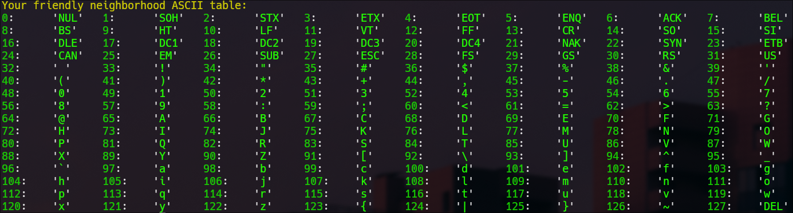

# ASCII Reference

A small C program that prints the complete ASCII table directly in your terminal. It uses ANSI colors and automatically adapts its layout to the terminal width, providing a quick offline reference for ASCII values from `0` to `127`.



## Features

- Displays all 128 ASCII values
- Shows control-character names such as `NUL`, `LF`, `ESC`, and `DEL`
- Uses ANSI colors for readability
- Adapts the number of columns to the terminal width
- Requires no external libraries
- Works completely offline

## Installation

### Requirements

The installation script is intended for Linux and requires:

- A C compiler: `gcc`, `clang`, or `cc`
- `sudo` privileges

### Install from source

Clone the repository and enter its directory:

```sh
git clone https://github.com/vNPE/Ascii-reference.git
cd Ascii-reference
```

Run the installation script:

```sh
sh install.sh
```

The script will:

1. Look for `gcc`, `clang`, and `cc`, in that order.
2. Select the first available compiler.
3. Verify administrator access.
4. Compile `asciiReference.c` into an executable named `ascii`.
5. Move the executable to `/bin`, making it available system-wide.

If no supported compiler is found or administrator authentication fails, the installation stops without installing the program.

## Usage

After installation, run the program from any terminal:

```sh
ascii
```

The table automatically adjusts to the current terminal width.

## Manual compilation

To compile and run the program without installing it system-wide:

```sh
gcc asciiReference.c -o ascii
./ascii
```

You can replace `gcc` with `clang` or another compatible C compiler.

## Uninstallation

Remove the globally installed executable with:

```sh
sudo rm /bin/ascii
```

## Platform support

The source includes terminal-size detection for Linux and Windows. The provided `install.sh` script is designed for Linux; on Windows, compile `asciiReference.c` manually with a compatible C compiler and run the resulting executable in a terminal that supports ANSI colors.
